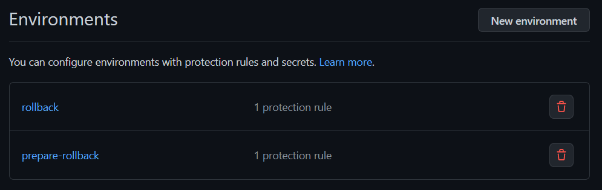
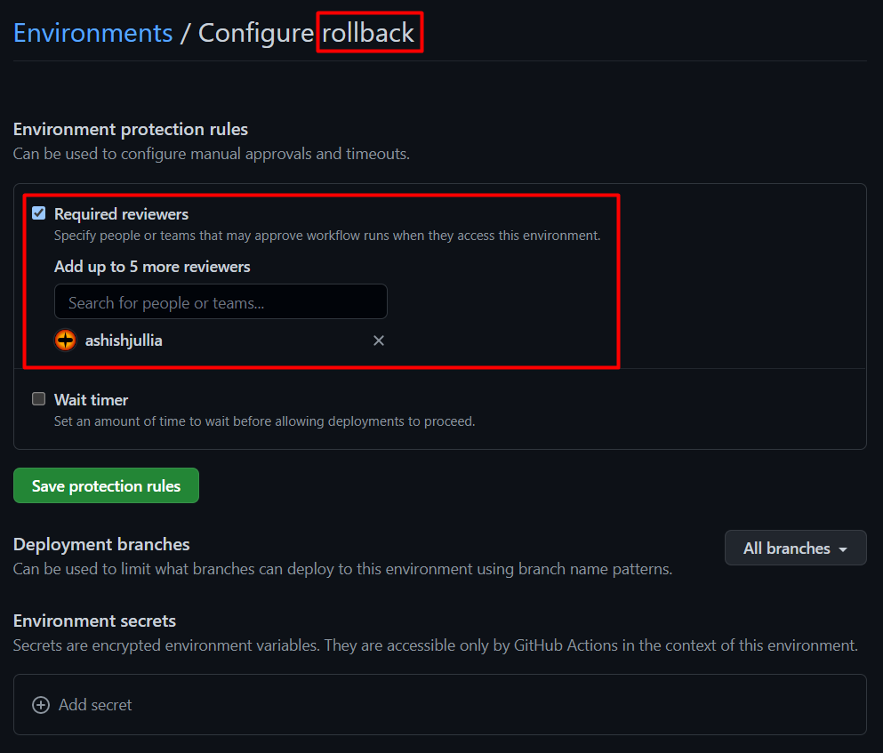

### Terraform with Rollback Mechanism using GitHub Actions (Generic Solution)
> **Note**: I tested this on **AWS** only as of  now.

By deault there is no such rollback option or mechanism available in terraform (atm of writing this).

So, in order to adapt terraform to my usual tasks I never found myself comfortable in using it in production but not anymore, I decided to leverage the functionality of GitHub Actions along with S3 bucket, DynamoDB Table and GitHub Releases.

#### Step 1: Make sure to create an IAM User and attach the following policy to it

Below is the minimum required permissions (IAM policy) for the IAM user configured for the gh actions in order to initialize/setup/create terraform s3 backend.

```json
{
    "Version": "2012-10-17",
    "Statement": [
        {
            "Sid": "S3SpecificAndGeneric",
            "Effect": "Allow",
            "Action": [
                "s3:GetLifecycleConfiguration",
                "s3:GetBucketTagging",
                "s3:GetBucketLogging",
                "s3:CreateBucket",
                "s3:ListBucket",
                "s3:GetAccelerateConfiguration",
                "s3:GetBucketPolicy",
                "s3:GetBucketObjectLockConfiguration",
                "s3:GetEncryptionConfiguration",
                "s3:PutBucketTagging",
                "s3:GetBucketRequestPayment",
                "s3:PutBucketAcl",
                "s3:DeleteBucket",
                "s3:PutBucketVersioning",
                "s3:GetBucketPublicAccessBlock",
                "s3:PutBucketPublicAccessBlock",
                "s3:GetBucketWebsite",
                "s3:GetBucketVersioning",
                "s3:GetBucketAcl",
                "s3:GetReplicationConfiguration",
                "s3:GetBucketCORS",
                "s3:PutEncryptionConfiguration",
                "s3:GetObject",
                "s3:PutObject",
                "s3:DeleteObject"
            ],
            "Resource": [
                "arn:aws:s3:::<bucket-name>",
                "arn:aws:s3:::<bucket-name>/*"
            ]
        },
        {
            "Sid": "DynamoDBSpecificTable",
            "Effect": "Allow",
            "Action": [
                "dynamodb:GetItem",
                "dynamodb:DescribeTable",
                "dynamodb:PutItem",
                "dynamodb:DeleteItem",
                "dynamodb:CreateTable",
                "dynamodb:TagResource"
            ],
            "Resource": [
                "arn:aws:dynamodb:*:*:table/<dynamodb-table-name>"
            ]
        },
        {
            "Sid": "DynamoDBGeneric",
            "Effect": "Allow",
            "Action": [
                "dynamodb:ListTables"
            ],
            "Resource": [
                "arn:aws:dynamodb:*:*:table/*"
            ]
        },
        {
            "Sid": "S3Generic",
            "Effect": "Allow",
            "Action": [
                "s3:ListAllMyBuckets"
            ],
            "Resource": "*"
        }
    ]
}

```

Before using the policy above^, make sure to substitute `<bucket-name>` and `<dynamodb-table-name>` as per your needs.


Official policy suggestion by the terraform (HashiCorp) on their website are:
- [for S3 Bucket](https://developer.hashicorp.com/terraform/language/settings/backends/s3#s3-bucket-permissions "for s3 bucket")
- [for DynamoDB Table](https://developer.hashicorp.com/terraform/language/settings/backends/s3#dynamodb-table-permissions "for DynamoDB Table")

But as you can see that I've added more permissions to it because in the GitHub Actions we are checking under `deploy-dev.yml` inside the job `initialize-tf-backend-if-does-not-exists` that whether the backend already exists or not, if not create one and set it for the provide tf code.

> **Note**: S3 bucket (or specifically the key/directory/folder) the DynamoDB table will not get deleted even after `terraform destroy` as that will be created by `aws cli` and not with the `terraform code`, so it will be out of context of terraform (this was intentional for this mechanism).

Apart from this^ policy whatever you perform/create `resources` in your AWS account, you have to add more permissions/policies to your the IAM user configured for the gh actions.

#### Step 2: In order to use this mechanism with your tf code, make sure you have the following files before you start writing your `.tf` files (get these from this repository - feel free to clone)

```bash
├── .auto.tfvars
├── .github
│   └── workflows
│       ├── deploy-dev.yml
│       └── destroy-dev.yml
├── .gitignore
├── .terraform-version
├── backend.tf
├── provider.tf
├── variables.tf
```
##### 2.1: Populate the values for the following variables from `./.github/workflows/deploy-dev.yml`

```
  TF_STATE_BUCKET_NAME: ""
  TF_STATE_BUCKET_KEY: "<maybe-a-folder-name>/terraform.tfstate"
  TF_STATE_BUCKET_REGION: ""
  TF_STATE_DYNAMODB_TABLE_NAME: ""
  TF_STATE_DYNAMODB_TABLE_REGION: ""
```
##### 2.2: Create two `environments` under


These^ are actually two job names specified in `./.github/workflows/deploy-dev.yml`

Whenever these two jobs will start to execute (depending upon the conditions i.e. whenever the conditions `pass`)



Also^, make sure to set/assign approvers for both of these environments (you can choose yourself as an approver).

> **Note**: Make these two environments (with approvers) with the same names speicified as `prepare-rollback` and `rollback`.**Note**: Make these two environments (with approvers) with the same names speicified as `prepare-rollback` and `rollback`.

##### 2.3: Populate the values for the variables specified in `./.auto.tfvars`
For this, make sure that the variables are defined in `./variables.tf` and then their values should be populated under `./.auto.tfvars`

##### 2.4: Populate the `./.terraform-version` file with the terraform version you want to create your resources with

#### Step 3: Create your resource blocks under `.tf` files and put under same directory structure (root)

#### Step 4: Push the changes
```bash
git add .
git commit -m "message"
git push
```
